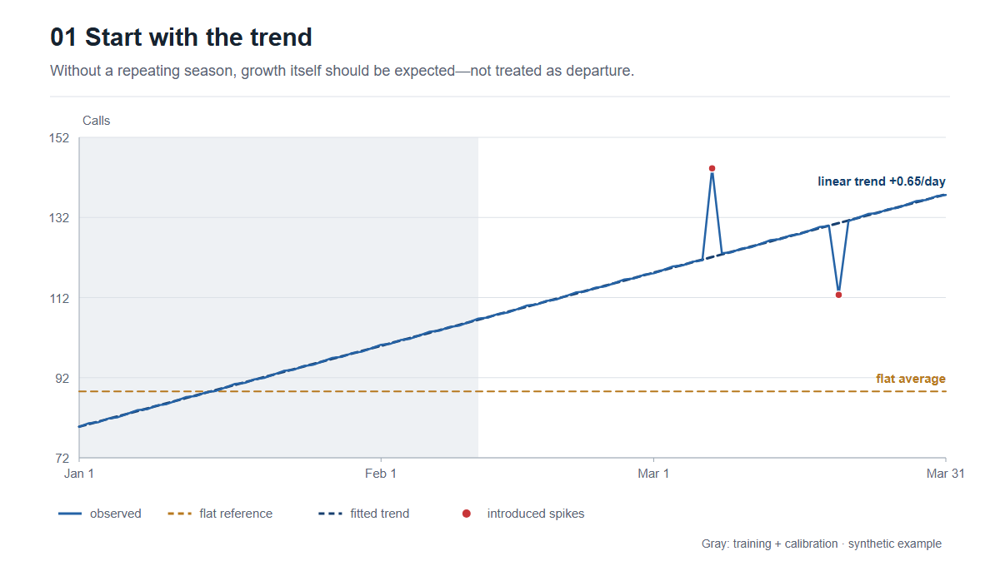
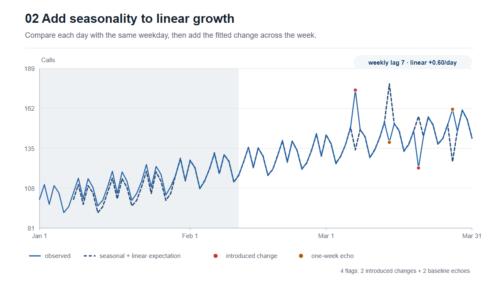
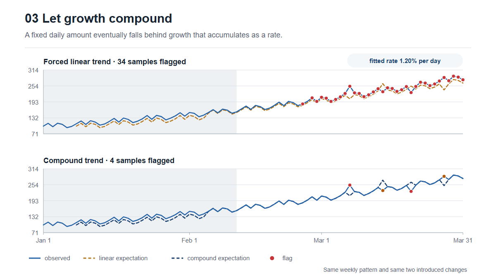
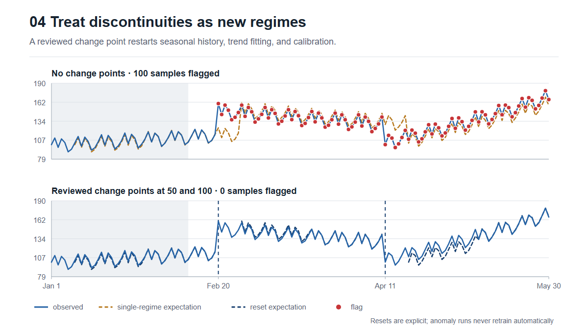
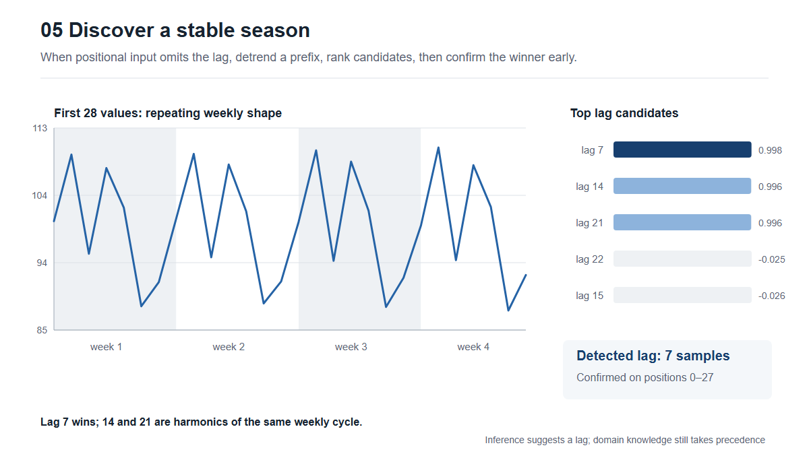
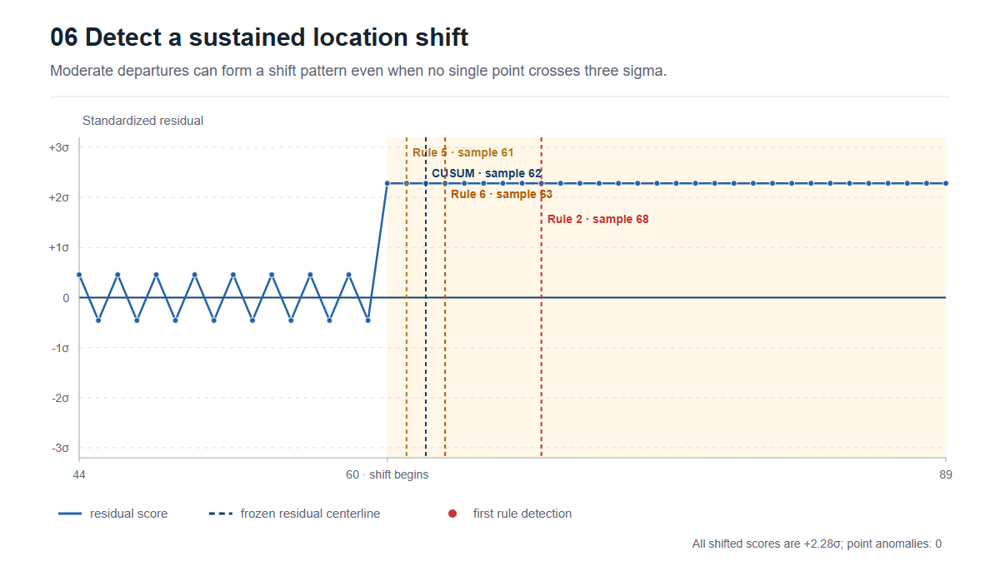
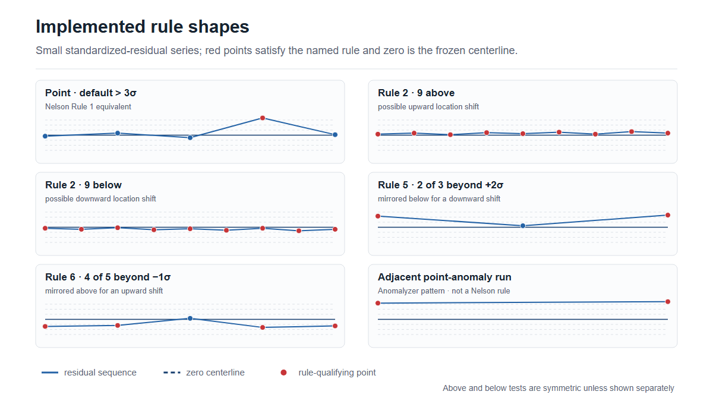
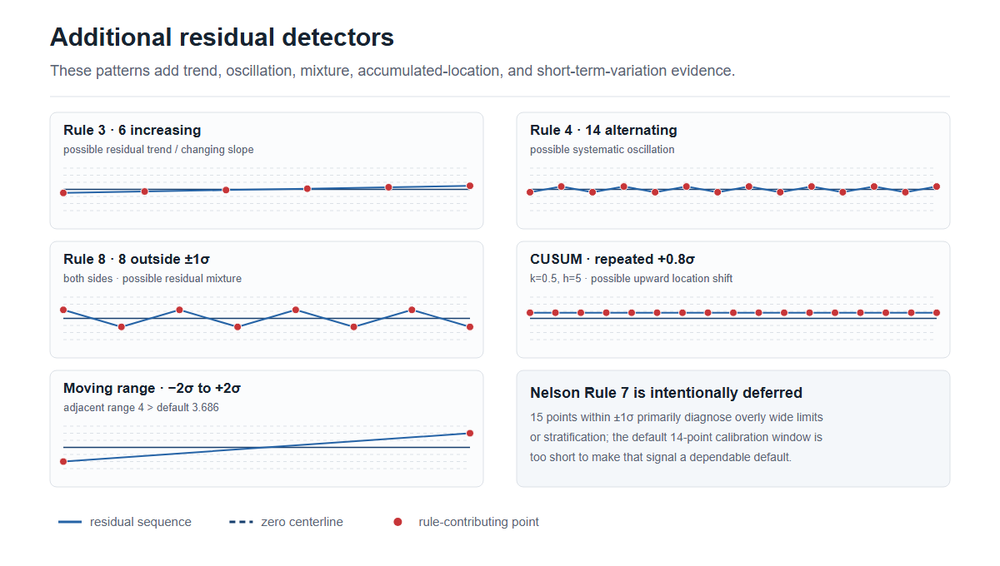

# Anomalyzer

[](https://github.com/PredictabilityAtScale/anomaly-detection/actions/workflows/ci.yml)
[](https://www.python.org/)
[](LICENSE)

A small local CLI and Python API for **time-series anomalies**. Forecasting is
only an internal baseline for anomaly scoring; there is no standalone forecasting
or distribution-comparison feature.

Anomalyzer provides deterministic, inspectable evidence rather than a black-box
alert. It supports timestamped CSV and JSON or ordered numeric values, causal
seasonal/trend baselines, calibrated residual scores, explicit regime resets,
and several residual-pattern checks. It runs locally and requires no hosted
service or model API.

> [!NOTE]
> Anomalyzer is an alpha release. Validate thresholds and detector behavior on
> representative historical data before using its output for operational decisions.

## Quick start

Install from a checkout with Python 3.11–3.13:

```bash
python -m pip install -e .
anomalyzer analyze examples/spike.csv --time timestamp --value calls \
  --frequency 1d --season-length 7 --format json
```

Or call the Python API:

```python
import json
from anomalyzer import analyze

with open("examples/spike.json", encoding="utf-8") as stream:
    result = analyze(json.load(stream))

print(result.model_dump_json(indent=2))
```

The checked-in [examples](examples/README.md) cover ordinary behavior, spikes,
drops, growth, sustained shifts, and explicit regime resets.

## The progression

An anomaly is only a departure from an expectation. The useful detector grows by
making that expectation more realistic, one assumption at a time. These figures
use the checked-in synthetic examples and real detector output; they demonstrate
mechanics, not real-world accuracy.

### 1. Start with the trend

With no repeating season, a flat average is the wrong reference for a series that
is steadily growing. Ordinary later values drift farther from that average and
can look exceptional simply because time passed. A fitted linear trend turns the
growth into the expectation, leaving the two introduced spikes visibly distinct.



### 2. Add seasonality to linear growth

Real series often grow while repeating a weekly shape. Comparing Monday with the
overall average still confuses seasonality with change. Anomalyzer instead compares
each observation with the same point in the previous season and adds the fitted
linear change across that seven-day gap. The red points are the introduced changes;
the orange points show the seasonal-naive echo that appears when each changed value
becomes the reference one week later.



### 3. Let growth compound

A straight line adds the same amount every day. Compound growth adds the same
*rate*, so the absolute increase gets larger over time. Forced linear trend leaves
a widening residual and flags 34 samples in this example. With five seasonal
cycles in its training window, the compound model
follows the changing rate and reduces the result to four flags: the two introduced
changes and their two one-week echoes.



### 4. Treat discontinuities as new regimes

One continuous trend cannot explain a series whose level and direction change at
known boundaries. Without that context, both later regimes remain departures and
100 consecutive samples are flagged. With reviewed change points at positions 50
and 100, seasonal history, trend fitting, and calibration restart inside each
segment. The three regimes are then modeled independently and no samples flag.
Resets are always explicit: Anomalyzer does not automatically normalize an anomaly
run that may still be a real incident.



### 5. Discover the season

Sometimes value-only positional data arrives without a known lag. Anomalyzer
detrends an initial prefix, ranks autocorrelation candidates, and requires the same
candidate to win in its earliest three-cycle window. Here lag 7 is confirmed from
positions 0–27; lags 14 and 21 are harmonics of the same weekly cycle. Inference is
a conservative suggestion—an explicit domain setting still takes precedence.



### 6. Detect a sustained location shift

Not every meaningful change contains an individually extreme observation. In this
example, the residual process moves upward to a steady +2.28 standard deviations,
so no point crosses the three-sigma anomaly threshold. The selected Nelson rules
still expose the concentration on one side of the frozen residual centerline:
Rule 5 first signals at sample 61, CUSUM at 62, Rule 6 at 63, and Rule 2 at 68. These are
described as possible **upward location shifts** relative to the seasonal/trend
expectation. They do not claim that the full distribution changed, identify a
cause, or automatically establish a new operating regime. The downward example
has symmetric behavior.



#### The implemented rule shapes

The small series below use standardized residuals, not raw observations. Zero is
the frozen calibration-residual centerline; positive values are above the
seasonal/trend expectation and negative values are below it. The numbering follows
the standard [Nelson rules](https://en.wikipedia.org/wiki/Nelson_rules), but
Anomalyzer currently implements only the checks shown here.



| Check | Small residual series | Interpretation |
| --- | --- | --- |
| Point, default threshold | `[-0.2, +0.4, -0.5, +3.4, +0.1]` | The `+3.4` point exceeds 3σ. With the default threshold this is equivalent to Nelson Rule 1. |
| Nelson Rule 2, above | `[+0.2, +0.4, +0.1, +0.5, +0.3, +0.6, +0.2, +0.7, +0.4]` | Nine residuals above zero: possible upward location shift. |
| Nelson Rule 2, below | `[-0.2, -0.4, -0.1, -0.5, -0.3, -0.6, -0.2, -0.7, -0.4]` | Nine residuals below zero: possible downward location shift. |
| Nelson Rule 5 | `[+2.2, +0.3, +2.4]` | Two of three exceed +2σ: possible upward location shift. The test is mirrored below −2σ. |
| Nelson Rule 6 | `[-1.4, -1.2, +0.2, -1.6, -1.3]` | Four of five are below −1σ: possible downward location shift. The test is mirrored above +1σ. |
| Adjacent point-anomaly run | `[+3.2, +3.5]` | Two adjacent point anomalies form `consecutive_run`. This is an Anomalyzer summary pattern, not a Nelson rule. |

The remaining implemented detectors have different semantics:



| Check | Small residual series | Interpretation |
| --- | --- | --- |
| Nelson Rule 3 | `[-0.5, -0.3, -0.1, +0.1, +0.3, +0.5]` | Six increasing residuals: possible residual trend or changing model slope, not a location shift. The test is symmetric for decreasing values. |
| Nelson Rule 4 | `[-0.4, +0.4]` repeated seven times | Fourteen alternating residual moves: possible systematic oscillation, baseline echo, or missed periodic structure. |
| Nelson Rule 8 | `[+1.2, -1.2]` repeated four times | Eight residuals outside ±1σ on both sides: possible mixture, stratification, or missed structure. |
| Two-sided CUSUM | `+0.8` repeated seventeen times | With defaults `k=0.5`, `h=5`, moderate positive evidence accumulates until the positive CUSUM crosses its threshold: possible upward location shift. A negative CUSUM mirrors it. |
| Moving range | `[-2.0, +2.0]` | The adjacent range is 4, above the default standardized threshold 3.686: possible short-term variation increase, not a location shift. |

Rule 2 counts side, not magnitude: nine small positive residuals can qualify.
Rules 5 and 6 count how many values in a short window cross a same-side sigma
band; the remaining values need not be on that side. “Possible location shift”
always refers to the center of the residual process, not proof of a general
distribution change.

Nelson Rule 7 is deliberately not enabled. Fifteen points within ±1σ usually
diagnose limits that are too wide or stratification; the default 14-point
calibration window is too short to make that a dependable default signal.

#### Why these detectors

Anomalyzer's point check is Shewhart-like, while Western Electric and common GE
rule profiles substantially overlap the implemented Nelson 1/2/5/6 behavior, so
they are not duplicated under additional names. CUSUM adds genuinely different
sensitivity by accumulating small same-direction residuals; NIST notes that it is
better than a Shewhart chart for mean shifts of roughly 2σ or less. Moving range
adds variation evidence, which the location rules do not provide. Nelson 3, 4,
and 8 are retained as explicit model/process diagnostics rather than being called
location shifts. EWMA remains a comparison candidate, not another default detector.
[NIST CUSUM](https://www.itl.nist.gov/div898/handbook/pmc/section3/pmc323.htm),
[NIST EWMA](https://www.itl.nist.gov/div898/handbook/pmc/section3/pmc324.htm),
[NIST Individuals/Moving Range](https://www.itl.nist.gov/div898/handbook/pmc/section3/pmc322.htm).

All of these checks operate on the same residual stream and are correlated
evidence, not independent votes. Seasonal-naive residuals can also be
autocorrelated and produce echo effects. Classical false-alarm rates therefore do
not transfer automatically; use chronological replay, including
`pattern_counts` and `first_detection_by_rule`, to compare detection delay and
alert burden before operational use. No pattern automatically resets the model.

Regenerate the six progression PNGs and both rule references with
`.venv/Scripts/python examples/render_readme_progression.py` (or the equivalent
`.venv/bin/python` command on Unix). The renderer is intentionally organized as
one figure function and one output entry per chapter so this progression can grow.

## Development

Python 3.11–3.13; verified on Windows with Python 3.12.

```powershell
uv sync --extra dev
.venv/Scripts/anomalyzer methods --format json
.venv/Scripts/python examples/run_demo.py
.venv/Scripts/anomalyzer analyze examples/spike.csv --time timestamp --value calls --frequency 1d --season-length 7 --format json
.venv/Scripts/anomalyzer analyze --config examples/shift.json
.venv/Scripts/python -m pytest -q
```

On Unix, use `.venv/bin/` instead of `.venv/Scripts/`.
Alternatively install into a compatible environment with
`python -m pip install -e '.[dev]'`.
The lockfile supports reproducible installs with `uv sync --locked --extra dev`.

## Command-line help

Start with `anomalyzer --help` for command discovery, then
`anomalyzer analyze --help` for input requirements, option meanings and defaults,
configuration precedence, exit codes, and copyable examples.
`anomalyzer methods --help` explains how to inspect the installed methods.
Use `.venv/Scripts/anomalyzer` if the executable is not on your PATH, or
`.venv/bin/anomalyzer` on Unix. Each command also accepts `-h`.

The [example walkthrough](examples/README.md) checks ordinary behavior, a spike,
a drop, and a sustained change, including the baseline's echo/adaptation limits.

## One baseline, inspectable residual checks

The expectation for sample `t` is the observed value at `t - season_length`,
plus the fitted trend's change between those two positions.
A season of 1 uses the previous observation; 7 can represent weekly seasonality
in daily data. Each prediction uses only earlier samples.

`trend` defaults to `auto`, which fits linear and exponential (compound) trends
with additive seasonal offsets using only the completed training window. Both
upward and downward trends are supported. Each increase in complexity must cut
training residual sum of squares by at least 50%; otherwise the simpler model is
retained. Exponential fits require positive amplitude. Model selection is a
heuristic, not a statistical confidence test. Fitting requires at least
`max(8, 4 * season_length)` training samples; shorter windows disclose a fallback
to no trend. The fit uses at most the final `max(256, 4 * season_length)` training
samples. Exponential log rates are bounded by the smaller of 0.1 per sample and
20 divided by the fit-window length.

Use `--trend linear`, `--trend exponential`, or `--trend none` to override auto
selection (JSON uses the `trend` key). `none` preserves the original
`seasonal_naive` method; other settings report `seasonal_trend`, with the selected
model and fitted parameters in `diagnostics.trend`. Unsupported exponential fits
fall back to no trend with a diagnostic reason. Early reference evidence remains
seasonal-only until training completes. The trend is then frozen before
calibration, so evaluation observations cannot change its fitted parameters.
Changes in growth rate can still flag; contamination in training and long-range
extrapolation can reduce accuracy. Overflow stops scoring with a disclosed error.

Evidence begins as soon as one full season is available. Defaults reserve 28
initial samples (at least one season), then 14 calibration samples. Calibration
forecast errors establish a mean and sample standard deviation. These remain
fixed while later samples are scored:

```text
residual = observed - expected
score = (residual - calibration_mean) / max(calibration_stddev, scale_floor)
flag when abs(score) > point_threshold
```

Each evidence record has a `signal_maturity`:

- `reference_only` reports the raw residual and relative deviation
  (`residual / abs(expected)`, or null when undefined) once `season_length`
  earlier samples exist. It has no standardized score.
- `provisional` reports a causal standardized residual after at least three
  earlier calibration residuals exist. Its scale is still changing.
- `calibrated` uses the complete frozen calibration window.

Only calibrated evidence can cross the point threshold or form an anomaly
episode. Reference-only and provisional evidence are deliberately non-triggering.
The default threshold is 3; it is an exploratory threshold, not a probability.
Zero or tiny variance uses an explicit scale floor (default 1e-8 in input units)
and reports a limitation. At least one sample after calibration is required for
calibrated scoring. Before that, the result is `insufficient_history` but contains
the weaker evidence available so far.

With `season_length=7`, `training_size=2`, and the default 14-point calibration,
the first calibrated score needs 21 prior samples; the default 28-point training
reservation instead needs 42. Reducing that reservation is an explicit tradeoff:
the seasonal-naive baseline itself needs only one season, but a longer ordinary
history makes the chosen calibration window easier to inspect and defend.

Consecutive flagged samples form episodes. The detector also analyzes the binary
point-anomaly stream: two or more adjacent flags produce a `consecutive_run` in
`anomaly_patterns`. Each underlying flag remains intact. This second-order record
describes an unusual run; it does not assign a probability, decide that the run
is a regime change, suppress evidence, or retrain the baseline.

The same `anomaly_patterns` collection contains three Nelson rules and CUSUM that are
specifically interpreted as possible shifts in the location, or center, of the
calibrated residual process:

- Rule 2: 9 consecutive residuals on the same side of the frozen centerline.
- Rule 5: 2 of 3 residuals beyond 2 standard deviations on the same side.
- Rule 6: 4 of 5 residuals beyond 1 standard deviation on the same side.
- CUSUM: a positive or negative standardized-residual cumulative sum crosses
  configurable decision threshold `cusum_h` after allowance `cusum_k`.

Other entries have deliberately different meanings:

- Rule 3: a possible increasing or decreasing residual trend.
- Rule 4: possible systematic oscillation.
- Rule 8: a possible residual mixture or missed structure.
- Moving range: a possible increase in adjacent residual variation.

Only consecutive, calibrated residuals participate; provisional evidence and gaps
or manual-reset boundaries break the sequence. Each pattern reports its rule,
direction, first detection index, triggering interval, evidence references, and a
plain-language description. For location patterns, `increase` and `decrease`
describe direction relative to the expectation; mixed-direction diagnostics use
`mixed`. These checks do not establish arbitrary changes in variance, tails, or
distribution shape. Classical false-alarm behavior can be changed by residual
autocorrelation, non-normal tails, and uncertain calibration estimates, so replay
the alert burden on representative history before operational use.

Results include
expected and observed values, residuals, scores, evidence references, data checks,
calibration windows, resolved settings, dependency versions, and an input fingerprint.
Readable output and JSON use the same result. Business impact remains unresolved.

This simple baseline adapts to a level change after one season. It can miss slow
changes, and a spike can cause an echo when it enters the next season's baseline.
Choose a representative calibration period and inspect flagged observations.
There is no EWMA, ensemble, broad automatic method search, or independent
incident probability. Positional value-only input can infer one candidate
sample lag as described below. Context about known events is preserved but does
not suppress flags.

`season_length` is one fixed lag measured in samples. For example, hourly data
can use 24 for a daily pattern or 168 for a weekly pattern; daily data can use 7
for a weekly pattern; weekly data can use 52 for an approximate annual pattern.
The current recipe models only one lag at a time. It does not model multiple
seasonalities, calendar months/holidays, or daylight-saving wall-clock patterns.

For value-only positional input, omit `season_length` to request conservative
inference. The detector detrends an initial prefix, ranks autocorrelation
candidates, requires at least three cycles, and confirms that the same lag wins
in its earliest three-cycle window. Calibration and evaluation remain later
windows. If no stable candidate passes the disclosed thresholds, lag 1 is used
and marked as a fallback. Inference is a suggestion, not proof of a real-world
cycle; explicit domain settings take precedence. Automatic candidates are
bounded to lags 2–512 and the first 4,096 usable selection values; longer lags
must be explicit. Timestamped input retains the default lag of 1 when no season
is supplied.

Known events can start new manual regimes with `reset_points` in JSON or repeated
`--reset-point` CLI options. Each value may be a zero-based sample position, a
`YYYY-MM-DD` date that identifies exactly one observed sample, or an exact
timestamp. Positions apply to the prepared chronological series after sorting,
duplicate aggregation, and `as_of` filtering. Position zero and points outside
the prepared series are rejected; duplicate resolved boundaries are rejected.

At a boundary, the sample belongs to the new segment. No seasonal reference
crosses the boundary. The segment rebuilds its seasonal history and then refits
trend using its own training window, followed by its own calibration window.
The configured `season_length` is reused; automatic lag inference is not rerun
per segment. Evidence is absent during the first season after a reset, then is
reference-only/provisional until segment calibration completes. A short final
segment therefore does not establish normality. Segment windows, fitted trends,
and calibration details appear in `diagnostics.segments`.

Resetting is always explicit. Consecutive anomalies and detected anomaly runs do
not reset or weaken the model automatically, because doing so could normalize a
real incident. Use a reset only when an external event or reviewed change point
establishes a new operating regime.

## Inputs and validation

CSV always requires a value column. Time and frequency are supplied together for
timestamped data or both omitted for ordered positional data. Empty values mean
missing, never zero. Extra varying columns are rejected; select one entity and
unit first. Canonical JSON supports one named dataset:

```json
{
  "schema_version": "1.0",
  "task": "analyze",
  "datasets": [{
    "id": "calls",
    "timestamps": ["2026-01-01T00:00:00Z", "2026-01-02T00:00:00Z"],
    "values": [100, 102],
    "frequency": "1d",
    "units": "calls"
  }],
  "config": {"season_length": 7}
}
```

This short input correctly returns `insufficient_history`. Longer synthetic
examples are in `examples/`; regenerate with `python examples/generate.py`.
JSON can be piped to `anomalyzer analyze - --input-format json --format json`.
It may also be a bare array such as `[100, 102, 101]`; combine that with CLI
settings or a separate `--config` settings file. Positional evidence has null
timestamps, zero-based sample indices and cutoff positions, and integer episode
intervals. Positions are assumed equally spaced because no cadence can be
validated.

Timestamps require an explicit offset or an IANA timezone. Ambiguous/nonexistent
local DST times require offsets. Cadence is a fixed duration, such as `1h`, `1d`,
`1w`, or `15min`; days are 24 elapsed hours and weeks are seven such days.
Sorting and UTC normalization are
reported. Duplicates require `--duplicate-policy mean|sum`; nulls propagate.
Missing values or irregular cadence make the baseline inapplicable. No imputation,
resampling, interpolation, or unit conversion occurs.

`--config` accepts settings or a complete canonical request. Precedence is
embedded settings, settings file, CLI flags. Unknown keys and options fail clearly.
The former `methods`, `alpha`, and `seed` settings are removed and rejected, as
is the former `baseline-v1` recipe. CUSUM uses positive `cusum_k` and `cusum_h`
settings (defaults 0.5 and 5); moving range uses positive
`moving_range_threshold` (default 3.686). The current recipe is
`seasonal-residual-v1`; omit the recipe field to use it.
Public JSON schemas are in `schemas/`, generated by `scripts/export_schemas.py`.

## Python API

```python
import json
from anomalyzer import analyze

with open("examples/spike.json") as stream:
    result = analyze(json.load(stream))
print(result.model_dump_json(indent=2))
```

Value-only data accepts settings separately:

```python
from anomalyzer import analyze

result = analyze([100, 103, 99, 102, 101], {"season_length": 1})
automatic = analyze([10, 20, 5, 15, 8, 30, 12] * 12)
```

The second form attempts positional season inference because `season_length` is
absent. All other configuration uses the normal validated defaults.

The internal `anomalyzer.evaluation.replay` helper reports held-out MAE/RMSE,
trigger counts, and episodes. Tests check independent numerical references,
chronological scoring, constant/seasonal/spike/shift data, invalid inputs,
schemas, reproducibility, failure handling, and CLI behavior.
Synthetic examples establish behavior, not product effectiveness.
No UsageTap data has been supplied.

## Output and limits

Stdout contains only the result; diagnostics use stderr. `--output PATH` writes
instead of printing and requires `--overwrite` to replace an existing file.

Exit 0 means completed, including anomalies, insufficient history, or
inapplicability. Exit 2 means invalid input/configuration. Exit 1 means execution
failure, interruption, or a partial/budget-limited run.

Defaults: 10,000 observations, 10 MB input, 60 seconds cooperative runtime.
Override with `--max-points`, `--max-bytes`, and `--max-runtime-seconds`.
Analysis is linear after timestamp sorting; limits are checked between samples.
Partial evidence is retained on execution failure. Numerical results are
deterministic; UUIDs and runtimes vary.

## Dependencies and scope

Numerical calculations use Python's standard library. Pydantic handles input
validation and schemas; Windows additionally needs `tzdata` for IANA timezones.
Pytest and jsonschema are development-only dependencies. StatsForecast, SciPy,
NumPy, pandas, Numba/LLVM, and their forecasting dependencies have been removed.

This intentionally narrows the original implementation plan to anomaly detection.
The historical plan and product brief describe broader possibilities, not current
commitments. No hosted service, model API, or MCP integration is involved.

The [problem framing](cli-plan.md) explains why chart aggregation should not
set the response time. The core already scores eligible samples at the supplied
cadence and exposes evidence, including below-threshold scores, through Python
and JSON independently of chart presentation. Applications can use that evidence
for AI agents and notification policies while keeping daily or weekly charts.
Monitoring schedules and notification delivery belong to the calling application.

## Contributing and security

Bug reports and focused pull requests are welcome. See [CONTRIBUTING.md](CONTRIBUTING.md)
for the development and verification workflow. Please report security issues using
the private process in [SECURITY.md](SECURITY.md), not a public issue.

## License

Anomalyzer is available under the [MIT License](LICENSE).
